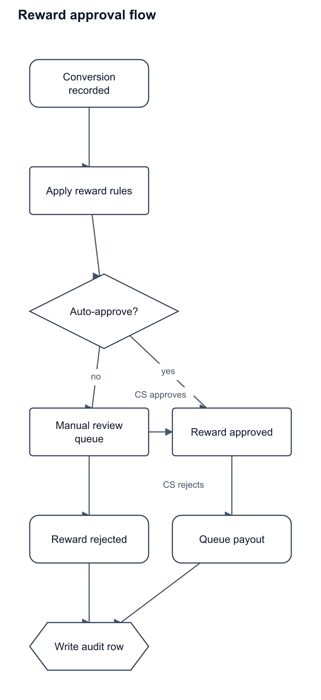

# diagram-mcp

MCP server that renders diagram-as-code text to PNG files on your disk. No browser, no network, no external service. Useful for generating flowcharts to drop into docs, tickets or READMEs.



## Tools

- `render_diagram`: code to a PNG, returns the file path
- `preview_diagram`: draws the diagram as text art, straight into the conversation, writes no file
- `validate_diagram`: parse and report errors with line numbers, writes nothing
- `diagram_syntax`: the language reference

## Install

Requires Node 20.12+.

```bash
git clone https://github.com/JVmano/diagram-mcp.git
cd diagram-mcp
npm install
npm run build
```

Then register it with Claude Code:

```bash
claude mcp add diagram --scope user \
  --env DIAGRAM_MCP_OUTPUT_DIR=$HOME/Documents/diagram-renders \
  -- node "$(pwd)/dist/index.js"
```

Or add it by hand to `.mcp.json` / your user config:

```json
{
  "mcpServers": {
    "diagram": {
      "type": "stdio",
      "command": "node",
      "args": ["/absolute/path/to/diagram-mcp/dist/index.js"],
      "env": { "DIAGRAM_MCP_OUTPUT_DIR": "/absolute/path/to/renders" }
    }
  }
}
```

Restart the session, then ask for a diagram. Run `npm run build` again after pulling changes.

## Language

```
title "Reward approval flow"
direction TB

node event "Conversion recorded" shape=rounded
node auto "Auto-approve?" shape=diamond size=200x100
node queue "Manual review queue"

event -> auto
auto -> queue "no"
```

Shapes: `rect`, `rounded`, `ellipse`, `diamond`, `hexagon`. Connections: `from -> to ["label"] [style=solid|dashed]`. Positions with `at=x,y` are optional. Leave them out and the layout places the shapes. Call `diagram_syntax` for the full reference.

## Config

All optional, all with defaults. See `.env.example`. Renders go to `DIAGRAM_MCP_OUTPUT_DIR` (default `~/Documents/diagram-renders`). An explicit `outputPath` must stay inside that directory or the working directory unless `DIAGRAM_MCP_ALLOW_ANY_OUTPUT_PATH=true`.

## Development

```bash
npm test          # unit tests
npm run test:e2e  # builds, then drives the server over stdio
npm run verify    # typecheck, test, build, e2e
```

The parser, layout and SVG generation in `src/core` are shared with a local diagram editor project; `npm run check:sync` diffs them against it when it is checked out next door.
